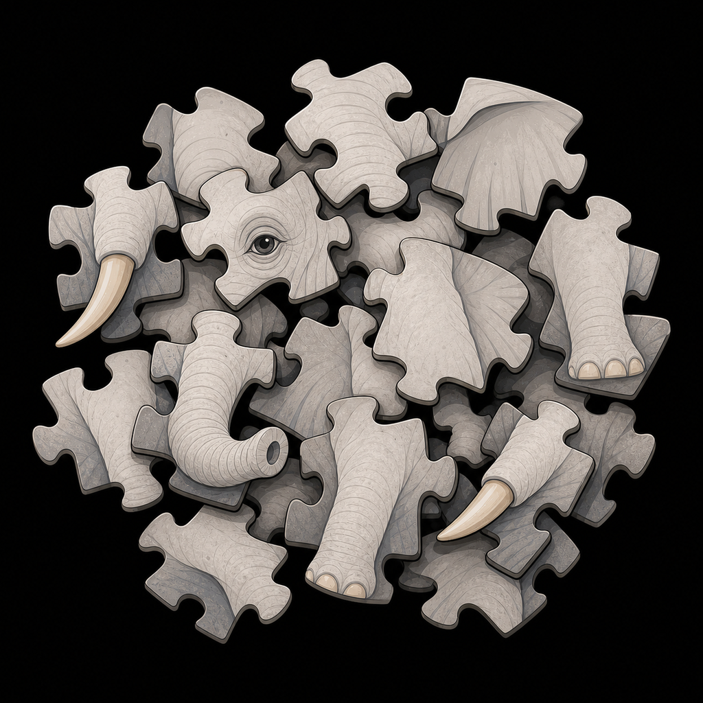

# 盲人摸象模型

<p align="center">
  
</p>

> 透过人群思考的阴影，得到复杂真相的轮廓。

**盲人摸象模型**是一种面向复杂问题的认知阴影反演框架。它不直接追求标准答案，而是生成一组结构异质的 AI 数字人，让他们在各自的认知身份证和信息过滤器下获取信息、分析问题、形成判断；随后由元模型审视他们从信息摄入到推理再到结论的完整过程，把偏见、局限、漏洞、沉默和分歧转化为拼图材料，反推出一个模糊但更接近真相的全局轮廓。

<p align="center">
  
</p>

它的核心方法不是“盲人摸象”，而是：

> 盲人摸象，我摸盲人。

## 为什么需要它

世界是复杂系统。公共政策、城市治理、企业战略、技术伦理、风险预警、社会争议、个人和组织重大决策，往往都具备这些特征：

- 单一视角必然过窄。
- 多方共识又难以达成。
- 事实、价值、风险和时间尺度纠缠在一起。
- 局部观点可能非常精确，却错误地伪装成整体真相。

传统群体思考模型通常试图综合观点、投票、辩论或寻找共识。盲人摸象模型关注的不是谁说对了，而是：

> 如果每个人都看歪了，那么什么样的真实形状，最能同时解释他们为什么这样看歪？

## 核心命题

复杂问题里，偏见、局限、漏洞和沉默不是废料，而是材料。

一个有偏判断可以抽象为：

```text
观测值 = 真相 + 偏见向量 + 噪声
```

如果元模型能够估计偏见向量的来源、方向和强度，那么这个错误判断就可以被转译成一个约束区间。多组不同方向的有偏观察叠加后，可以形成比任何单一观察者更稳健的真相轮廓。

## 系统结构

```text
复杂问题
  -> 问题类型识别
  -> 生成结构异质的 AI 数字人群
  -> 数字人按各自信息过滤器检索和取证
  -> 数字人按各自认知身份证分析和判断
  -> 证据账本记录信息摄入、证据选择、推理路径和结论
  -> 元模型用经典认知透镜诊断阴影
  -> 阴影被转译为锚点、约束带和负空间洞
  -> 输出当前材料能够支持的真相轮廓
```

## 两个核心部件

### 1. AI 数字人群

AI 数字人不是角色扮演，也不是 prompt 换皮。每个数字人都是一个结构化的有限理性观测器，拥有：

- 认知框架：归纳、演绎、溯因、类比、系统思维等。
- 专业知识域：它手上有什么材料可摸。
- 价值观权重：效率、公平、自由、安全、创新、传统等。
- 时间尺度：几天、几年、几十年、百年以上。
- 风险态度：风险规避、中性、追求，以及对未知不确定性的容忍度。
- 分析层次：个体、组织、结构、元层次。
- 内置认知偏差：确认偏误、锚定、过度自信、可得性启发等。
- 信息源与数据偏好：它会搜什么、信什么、排斥什么。
- 气质与情绪基调：乐观、悲观、怀疑、冷静、激进等。

数字人的价值不在于更聪明，而在于有结构地不完整。

标准版 24 个、深度版 50 个，指的是一次运行的 cohort size。每个复杂问题都会生成一批新的数字人；固定的是生成维度和生成协议，不是固定人物名单。

系统在生成数字人群前，先用本地问题语法识别事实、因果、预测、规范、概念和战略义务，再让同一批数字人一次性覆盖关键证据、定义分支、时间尺度、反证入口与受影响者位置。系统不在看过答案后自动追加“反叛数字人”或启动第二轮；标准版 24 人与深度版 50 人必须事先选择，首轮仍未覆盖的部分进入最终轮廓的明确未知。

### 2. 元模型

元模型不是上帝视角的裁判，而是一个认知阴影诊断与反演系统。它审视数字人从信息获取到结论形成的完整链条，识别：

- 分歧结构
- 盲区分布
- 偏见来源
- 论证漏洞
- 信息泡泡
- 价值冲突
- 范式冲突
- 集体沉默
- 自身分析的潜在盲区

当前执行层把这个过程称为“认知链透视”：9 张经典透镜与“局部整体越界”组成 10 个平行检测器，对每个数字人的问题理解、搜索、信息过滤、证据取舍、假设、推理、价值、结论、置信度和改判条件逐项检查。其后的“认知链判读层”只处理单个数字人的完整链，将重复候选压成最多两个根问题，用大白话说明它从什么具体材料推到了什么结论、中间缺了什么、结论该怎样改写。检测器名称只留在后台。

元模型必须自反：它也可能偏爱结构化、理性化、可计算的解释，因此每次输出都需要附带自反性声明。

## 阴影拼图

盲人摸象模型的独特性在于：阴影是拼图材料。

阴影至少分为两大类：

- **缺失性阴影**：所有人都未触及的维度，构成负空间洞。
- **扭曲性阴影**：有人说了，但说歪了、说窄了、说极端了，构成可反向矫正的畸变信号。

拼图时，元模型将材料转译为：

- **互锁锚点**：不同偏差方向的数字人在同一维度交叉验证后仍然重合的部分。
- **偏矫正碎片**：单个有偏判断经反向修正后得到的约束区间。
- **负空间洞**：集体盲区形成的未知结构边界。

最终输出不是标准答案，而是带有锚点、约束、未知部分和置信说明的真相轮廓。

## 经典知识库

元模型需要被经典著作武装。经典不是用来引用的，而是转化为诊断透镜：

- 《思考，快与慢》：偏差与启发式。
- 《噪声》：随机判断误差。
- 《笛卡尔的错误》：情绪与理性不可分割。
- 《隐藏的自我》《谁说了算？》：无意识加工与事后合理化。
- 《影响力》：社会影响与顺从机制。
- 《学会提问》：论证漏洞与隐含假设。
- 《专家的政治判断》：专家失效、刺猬与狐狸。
- 《科学革命的结构》：范式与不可通约。
- 《有限理性》：生态理性与适应性启发式。

每张透镜卡都包含机制链、观察信号、归因规则、反演规则、适用边界、防误用规则和元模型训练动作。当前还包含 41 个微透镜、11 条透镜竞争规则、6 个校准案例、19 类阴影生成机制和 11 阶段摸盲人捕捉协议，用来支持差分诊断、误诊审计和阴影机制捕捉。

经典在侦探层是辅助工具，不是裁判。侦探先独立发现并裁决关系；经典只能限额提示遗漏连接，或在裁决冻结后复核诊断解释。经典复核不能修改关系状态、置信度和真相权重，也不能替代现实证据。

最终输出仍是一段自然、可读的中文，而不是展示给用户的“原子主张”列表。后台会把直接回答和主轮廓按完整句子绑定到各自的拼图、关系与约束，并按句子承担的事实、方向、条件、结构、定义、未知或价值角色检查证据资格。未核验搜索摘要可以参与发现阴影和形成候选观察，不能借整段引用冒充已核验事实。

详见：

- `docs/09-meta-model-and-diagnostic-lenses.md`
- `docs/10-classic-digestion-for-meta-model.md`
- `docs/11-micro-lenses-and-differential-diagnosis.md`
- `docs/12-shadow-mechanism-ontology-and-scoring.md`
- `docs/13-live-batch-diagnosis-and-shadow-puzzle.md`
- `docs/14-local-whole-overreach-and-hard-meta-model.md`
- `docs/15-cognitive-chain-semantic-judgment.md`
- `docs/16-truth-contour-architecture-blueprint.md`
- `docs/17-classic-knowledge-provenance.md`
- `docs/18-resilient-run-system.md`
- `docs/19-performance-optimization-activation-gate.md`
- `docs/20-pre-release-epistemic-contract.md`

## 当前仓库内容

这是一个可重复、可恢复的开源研究系统。默认模型是 DeepSeek，但调用层使用 OpenAI 兼容接口；更换兼容模型只需配置端点、模型名、密钥和思考能力开关，不需要改写数字人、法医层、侦探层或轮廓层。

```text
docs/       模型理论与方法论
knowledge/  经典著作转译而来的诊断透镜库
schemas/    问题框架、数字人、证据账本、阴影、关系证书与真相轮廓的数据结构
prompts/    数字人与元模型的提示协议
src/        最小 Python 原型
examples/   示例问题与报告草图
tests/      基础测试
```

## 普通用户：下载后直接使用

Windows 用户不需要先配置环境变量，也不需要手动安装 Python 包：

1. 下载仓库 ZIP 并完整解压。
2. 双击根目录的 `install-windows.cmd`。
3. 安装结束后，浏览器会自动打开；选择模型服务和主模型，填写该服务的 API Key，点击“验证并开始”。默认 DeepSeek 配置只需填写 Key。

安装向导会检查 Python 3.10 或更高版本；电脑没有 Python 时，可通过 Windows Package Manager 安装 Python 3.12。随后它会创建项目专用的 `.venv`，并在桌面生成“盲人摸象模型”快捷方式。项目没有第三方运行依赖，不会执行额外的依赖下载。

以后直接双击桌面快捷方式，或双击根目录的 `start-windows.cmd`。启动器会复用已经运行的最新版服务；否则选择空闲端口、启动后台服务并打开首页。

桌面快捷方式指向当前解压目录；移动项目文件夹后，重新双击 `install-windows.cmd` 即可刷新快捷方式，不会清空设置或已有结果。

网页提供 DeepSeek、OpenAI 和“其他兼容接口”三种选择，主模型可以自行填写。DeepSeek 和 OpenAI 自动带入官方接口地址及默认的数字人生成模型；选择其他接口时填写其 Chat Completions 基础地址和模型名。更换供应商或接口地址必须输入新 Key，旧 Key 不会发送给新接口。Windows 下，Key 使用当前 Windows 账户的 DPAPI 加密，保存在 `%APPDATA%\BlindMenElephantModel\settings.json`；它不会写入仓库、运行报告、浏览器存储或服务日志，设置接口也只返回末四位。

## 开发者安装

需要 Python 3.10 或更高版本。克隆仓库后，可以在虚拟环境中以可编辑方式安装；这样命令行入口与仓库中的知识库、首页资源会保持在同一版本：

```bash
python -m venv .venv
# 激活虚拟环境后
python -m pip install --editable .
```

运行不访问外部服务的完整测试：

```bash
python tools/run_plain_tests.py
```

命令行真实运行可以通过环境变量提供凭据，详见下方“模型接口”。仓库不会提交用户设置、个人运行目录、日志和 `.env` 文件。

## 快速运行

Windows 网页入口会默认启动已经通过 24 人真实计时的流式优化链。安装向导创建快捷方式后无需再使用命令行；开发者也可以直接运行启动脚本：

```powershell
.\tools\start_web.ps1
```

启动器会先消除 Windows 进程环境中大小写重复的 `Path/PATH`，避免 PowerShell 5.1 的 `Start-Process` 因重复环境键失败。网页未配置时不会提前恢复旧任务，而是先完成 Key 验证；供应商和主模型直接在设置页选择，自定义接口地址会在选择“其他兼容接口”时出现，数字人生成模型在高级设置中调整。

默认命令只生成结构化运行计划，不消耗 API。

```bash
python -m bme_model plan "是否应该加快部署自动驾驶卡车？"
```

如果从源码目录运行：

```bash
PYTHONPATH=src python -m bme_model plan "是否应该加快部署自动驾驶卡车？"
```

Windows PowerShell:

```powershell
$env:PYTHONPATH="src"; python -m bme_model plan "是否应该加快部署自动驾驶卡车？"
```

过滤式检索和证据账本：

```powershell
$env:PYTHONPATH="src"; python -m bme_model retrieve "是否应该加快部署自动驾驶卡车？" --profile standard
```

诊断透镜库与元模型阴影显影：

```powershell
$env:PYTHONPATH="src"; python -m bme_model diagnose "是否应该加快部署自动驾驶卡车？" --profile standard
```

标准版 24 数字人批量流程测试（DeepSeek 真实生成数字人和回答，证据层为 mock）：

```powershell
$env:PYTHONPATH="src"; python -m bme_model run-standard-live "是否应该加快部署自动驾驶卡车？" --provider mock --model deepseek-v4-pro --retries 1 --output-dir runs
```

生产式运行启用逐阶段检查点、原子写入、单项定点补齐和 570 秒分析预算；恢复只续跑损坏或缺失的原任务，不是追加认知轮次。桌面启动器默认使用已完成真实计时验收的流式优化链；命令行显式运行方式如下：

```powershell
$env:PYTHONPATH="src"; python -m bme_model run-standard-live "美股AI泡沫会不会很快破灭" --provider three-layer --pipeline-mode streaming_v2 --synthesis-mode optimized_v2 --concurrency 24 --retrieval-concurrency 12 --semantic-concurrency 24 --model-concurrency 24 --retries 1 --recovery-passes 0 --time-budget-seconds 570 --output-dir runs-candidate
```

`run-standard-live` 的默认 provider 是 `three-layer`；`mock` 必须显式指定，只用于开发测试。
优化版让 24 条人物思考链流式并行，搜索限制为 12 路；模型请求经过自适应并发闸门，遇到限流或暂时性服务压力会自动降速，不改变模型、token 上限或质量门槛。2026-07-28 的一次全新、无缓存标准运行从提交到报告就绪耗时 469.398 秒，24 人与三层分析全部通过；详情见 `docs/19-performance-optimization-activation-gate.md`。供应商拥堵和本地网络仍会造成波动，命令行无参数模式暂保留基线用于跨领域对照，普通网页入口默认使用优化链。

`benchmarks/` 保存历史验收清单与审计摘要；出于体积和本地运行数据隔离考虑，清单引用的 `runs/` 原始目录不随仓库发布。下载者可以用自己的 Key 运行新问题，但不能仅凭仓库重放那些历史运行。

每个运行目录都有 `run_manifest.json` 和 `quality.json`。查看进度或恢复中断任务：

```powershell
$env:PYTHONPATH="src"; python -m bme_model run-status runs\RUN_ID
$env:PYTHONPATH="src"; python -m bme_model resume-run runs\RUN_ID
```

部署服务启动时可自动扫描并恢复遗留任务，无需人工判断应该重跑哪个阶段：

```powershell
$env:PYTHONPATH="src"; python -m bme_model recover-runs --output-dir runs --limit 10
```

启动首页和后台任务服务：

```powershell
$env:PYTHONPATH="src"; python -m bme_model serve --host 127.0.0.1 --port 8765 --runs-dir runs --provider three-layer
```

首页提交同一运行中的问题会复用原任务，不会重复创建并行调用；浏览器刷新后会从本地保存的任务 ID 继续读取真实进度。结果页链接只在最终质量门通过后出现。

恢复遵循输入指纹和质量门：有效制品直接复用；损坏或输入不匹配的单个数字人只重跑该人；语义判决、侦探提案、对抗裁决、经典复核和三步轮廓各自独立续跑。鉴权错误不会被无意义反复调用，超时会标记远端结果不确定，mock 也不会静默冒充真实证据。

如果要让数字人先暴露“脑中先验”，再带着过滤器进入搜索，可使用 hybrid provider：

```powershell
# 只有模型先验层，不访问外部搜索
$env:PYTHONPATH="src"; python -m bme_model retrieve "城市是否应该延长公共图书馆开放时间？" --profile standard --provider model-prior

# 先验层 + 本地模拟搜索，适合开发验证
$env:PYTHONPATH="src"; python -m bme_model retrieve "城市是否应该延长公共图书馆开放时间？" --profile standard --provider hybrid-mock

# 先验层 + 海外搜索路由；有 Google Custom Search 凭据时优先使用，否则走真实 RSS/网页搜索
$env:PYTHONPATH="src"; python -m bme_model retrieve "城市是否应该延长公共图书馆开放时间？" --profile standard --provider hybrid-global
```

每次 `run-standard-live` 都先单独调用所选大模型，只根据本题生成一批新的问题原生数字人和问题框架，保存为 `cohort.json`；随后检索、证据账本、数字人回答和元模型诊断共用同一个 `cohort_id`。固定继承的只有九维认知参数空间，不继承上一题的职业、事实、案例、结论或专用措辞。默认 DeepSeek 配置让 `deepseek-v4-flash` 承担 cohort 身份生成；数字人推理、语义判决、侦探层和轮廓层使用 `deepseek-v4-pro`。改选模型后，这两项由用户设置决定。

`mock` 与 `hybrid-mock` 只能用于流程测试，结果页会明确显示 `test_fixture`。真实 Google 模式默认禁止静默降级为 mock；如需测试假材料，必须显式选择 mock provider。

重建已保存运行的元模型诊断与阴影拼图，不会再次调用大模型：

```powershell
$env:PYTHONPATH="src"; python -m bme_model rebuild-run runs\20260701-171851-standard
```

为已保存运行补做逐人认知链语义判读：

```powershell
$env:PYTHONPATH="src"; python -m bme_model enrich-verdicts runs\20260701-171851-standard --model deepseek-v4-pro
```

中国/海外搜索 provider：

```powershell
# 中国：配置 endpoint 时使用 baidu-json；否则组合 Google News RSS、Bing RSS 与百度网页
$env:PYTHONPATH="src"; python -m bme_model retrieve "是否应该加快部署自动驾驶卡车？" --profile standard --provider auto-cn

# 海外：有凭据时使用 Google Custom Search；否则组合 Google News RSS、Bing RSS 与网页备用源
$env:PYTHONPATH="src"; python -m bme_model retrieve "是否应该加快部署自动驾驶卡车？" --profile standard --provider auto-global

# 混合模式：中国/海外搜索前都会先加入数字人的模型先验层
$env:PYTHONPATH="src"; python -m bme_model retrieve "是否应该加快部署自动驾驶卡车？" --profile standard --provider hybrid-cn
$env:PYTHONPATH="src"; python -m bme_model retrieve "是否应该加快部署自动驾驶卡车？" --profile standard --provider hybrid-global
```

标准版和深度版：

```powershell
$env:PYTHONPATH="src"; python -m bme_model plan "是否应该加快部署自动驾驶卡车？" --profile standard
$env:PYTHONPATH="src"; python -m bme_model plan "是否应该加快部署自动驾驶卡车？" --profile deep
```

## 模型接口

仓库不保存 API key。普通网页用户直接使用内置设置向导，网页服务优先使用用户在网页保存的整套供应商设置，避免旧环境变量中的 Key 被送往新供应商；没有保存设置时才读取环境变量。命令行或自动部署仍可通过环境变量独立配置。默认 DeepSeek 配置：

```powershell
$env:DEEPSEEK_API_KEY="your-api-key"
```

也可以接入其他 OpenAI 兼容模型；通用变量优先于 DeepSeek 专用变量：

```powershell
$env:BME_LLM_API_KEY="your-api-key"
$env:BME_LLM_PROVIDER_PRESET="openai-compatible"
$env:BME_LLM_BASE_URL="https://your-provider.example/v1"
$env:BME_LLM_MODEL="your-model"
$env:BME_COHORT_MODEL="your-faster-cohort-model"
$env:BME_LLM_SUPPORTS_THINKING="false"
$env:BME_INPUT_PRICE_PER_1M_CNY="your-input-price"
$env:BME_OUTPUT_PRICE_PER_1M_CNY="your-output-price"
```

模型端点需要兼容 OpenAI Chat Completions、工具调用和 JSON 输出。自定义接口若不支持模型列表，设置页可保存但无法在此阶段验证其模型能力；不支持 DeepSeek 风格 `thinking` 参数时，保持 `BME_LLM_SUPPORTS_THINKING=false`，客户端不会发送该字段。数字人群生成、缺席补齐、法医层、侦探层和轮廓层共享同一兼容客户端契约，替换供应商不会改变流程结构。不同供应商的费用只在设置了对应 `BME_*_PRICE_PER_1M_CNY` 后估算。

搜索 API keys 同样走环境变量：

```powershell
$env:GOOGLE_API_KEY="your-google-key"
$env:GOOGLE_CSE_ID="your-google-cse-id"
$env:BAIDU_SEARCH_ENDPOINT="your-baidu-json-serp-endpoint"
$env:BAIDU_SEARCH_API_KEY="your-baidu-or-serp-key"
```

单独测试搜索 provider：

```powershell
$env:PYTHONPATH="src"; python -m bme_model test-search "城市公共图书馆开放时间" --provider google --limit 3
$env:PYTHONPATH="src"; python -m bme_model test-search "韩国股市 崩盘 KOSPI 风险" --provider google-news-rss --limit 3
$env:PYTHONPATH="src"; python -m bme_model test-search "韩国股市 崩盘 KOSPI 风险" --provider federated-html --limit 3
$env:PYTHONPATH="src"; python -m bme_model test-search "城市公共图书馆开放时间" --provider baidu-json --limit 3
$env:PYTHONPATH="src"; python -m bme_model test-search "城市公共图书馆开放时间" --provider baidu-html --limit 3
```

搜索数字人会收到本次运行日期；现状与预测问题必须优先查询截至该日期的最新材料。国际主题至少包含一条保持原认知身份证的英文查询。搜索结果先通过相关性闸门，再由数字人按自己的过滤器决定采信、拒绝或忽略；结果页会展示这些轨迹以及它们如何进入阴影拼图。

跨题隔离审计：

```powershell
$env:PYTHONPATH="src"; python tools\audit_cross_question_isolation.py
```

运行单个数字人：

```powershell
$env:PYTHONPATH="src"; python -m bme_model run-person "是否应该加快部署自动驾驶卡车？" crisis_engineer --model deepseek-v4-pro
```

## 非目标

盲人摸象模型不是：

- 投票系统。
- 多智能体辩论系统。
- 专家替代品。
- 事实核查工具本身。
- 伪中立的各打五十大板。
- “更多观点 = 更接近真相”的朴素综合。

它的目标是让认知阴影变得可见、可比较、可追溯、可反演。

## 项目状态

当前已形成带完整审计链、质量门和断点恢复的可运行研究系统，正在从本地研究工具继续走向多用户服务。后续可以继续接入：

- 更多可替换的搜索 provider
- RAG 知识库
- 证据账本数据库
- 真相轮廓的交互式关系展示
- 多轮反叛者数字人补盲机制
