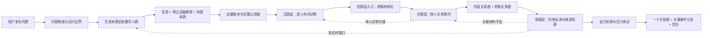

# 盲人摸象模型：完整设计图纸

版本：Truth Contour Architecture v1.0<br>
状态：设计基线<br>
日期：2026-07-24

## 0. 本文的地位

这份文档是后续开发、测试、报告生成和验收的统一设计基线。它吸收并覆盖此前关于数字人、证据账本、元模型、诊断透镜、阴影拼图、侦探层和制图层的讨论。

最新决定具有最高优先级：

1. 系统最终只交付“真相轮廓”。
2. “多分辨率认知地图”不再是概念目标、系统层或数据产品。
3. 原“制图层”统一改称“轮廓层”，避免把推理任务误解成图形展示任务。
4. 内容关系图和阴影关系图只作为内部推理结构，不作为最终产品。
5. 第一眼必须直接回答用户提出的问题，不能先展示术语、流程或群体观点。

旧文档若与本设计冲突，以本文为准。

---

## 1. 一句话定义

盲人摸象模型通过一批结构异质、带有信息过滤器的 AI 数字人观察同一个复杂问题，把这些数字人的完整思考过程当作研究对象，先识别每个人看见、看错和没看见的地方，再连接这些局部与阴影，最终反演出一个模糊、有边界、但比任何单一视角更接近真相的全局轮廓。

```text
数字人负责暴露认知局部与阴影
法医层负责逐人诊断
侦探层负责把诊断变成拼图并建立关系
轮廓层负责根据关系反演全局形状
最终交付真相轮廓
```

## 2. 核心命题

### 2.1 世界与观察者

复杂问题不存在一个能够轻易获得上帝视角的单点观察者。每个观察者都受到专业知识、信息入口、价值排序、风险态度、时间尺度、分析层次、认知框架和情绪气质的塑形。

单个数字人不是“全瞎”，而是同时拥有三类区域：

- 可保留的局部：当前有一定依据、暂未被诊断击穿的部分。
- 已知有偏的局部：已经发现偏见、局限、漏洞、错位或证据污染的部分。
- 未见区域：没有观察、无法命名或尚未意识到其相关性的部分。

### 2.2 核心反转

传统群体思考通常把偏见当噪声，试图消除偏见后进行投票、平均或共识汇总。

盲人摸象模型把偏见、局限、漏洞、信息过滤、沉默和分歧本身当作有结构的信息。它不只问“他们得出了什么答案”，还问：

- 为什么他们会得出这些答案？
- 哪些信息从一开始就没有进入他们的视野？
- 哪些局部判断被扩大成了整体结论？
- 哪些共识只是同一来源、同一模型先验或同一价值框架的复制？
- 哪些冲突其实由时间、范围、定义或价值差异造成？
- 什么样的全局形状能够同时解释这些观察与变形？

### 2.3 最终目标

模型不承诺标准答案，也不以“展示多元观点”为终点。它必须交付一个关于问题本身的主判断，同时诚实保留适用条件、关键分支和无法填补的空白。

```text
真相轮廓 =
关于问题本身的主判断
+ 主判断成立的时间、范围和条件
+ 能显著改变判断的关键分支
+ 当前不能被可靠填补的空白
+ 从轮廓语句回溯至原始材料的证据链
```

## 3. 不可违反的原则

1. 不投票，不取平均，不把数字人人数当作事实强度。
2. 不把“元模型未检出问题”当作“这段内容已经为真”。
3. 不把高分辨率等同于真相。高分辨率只表示局部被描述得清楚。
4. 不把共同沉默自动认定为真实盲区。必须先证明被遗漏维度与问题有实质关系。
5. 不把相反偏见自动视为彼此抵消。必须确认观察对象、定义、范围一致，并且偏差方向得到校准。
6. 不在没有校准依据时，对偏见做虚假的数值减法。
7. 不把相同网页、相同数据、相同基础模型先验重复计算为独立证据。
8. 不把事实冲突、定义冲突、价值冲突和时间尺度冲突混成同一种分歧。
9. 不让数字人重新自由辩论后再分析。原始认知链必须封存，防止群体趋同抹去阴影。
10. 不为了得到完整轮廓而强行建立连接、补齐因果桥梁或填满未知区域。
11. 允许输出“暂时无法判断”，但必须说明稳定部分和阻止判断的关键缺口。
12. 所有最终结论必须能够反向追溯到关系、拼图、诊断和原始认知链。
13. 元模型的流程完整度评分不是真相准确率。
14. 阴影都可以贡献信息，但不一定都能成为支撑结论的证据。
15. 系统内部可以复杂，用户可见表达必须具体、简明，并紧扣用户的问题。

## 4. 系统边界

### 4.1 适用问题

适用于单一视角容易失败、多个利益或知识体系难以形成共识的开放式复杂问题，例如公共政策、企业战略、复杂技术伦理、前瞻预测、社会争议和重大决策。

### 4.2 不适用问题

- 简单事实查询。
- 有唯一机械计算结果的问题。
- 缺少任何可观察材料、只能纯粹猜测的问题。
- 需要实时执行而非认知分析的问题。
- 用户只需要某个专业视角，而不是全局轮廓的问题。

### 4.3 系统不是什么

- 不是数字人投票委员会。
- 不是多角色换皮写作器。
- 不是搜索结果摘要器。
- 不是把经典书籍名称堆进提示词的 RAG。
- 不是自动拥有真相的超级模型。
- 不是群体意见关系可视化工具。
- 不是“认知地图”生成器。

---

## 5. 端到端架构



三层是一条连续证据链：

- 法医层处理“一个人内部发生了什么”。
- 侦探层处理“不同人的材料之间发生了什么”。
- 轮廓层处理“什么全局形状能够解释这些关系”。

任何一层都不得越权绕过前一层。

---

## 6. 问题框架

所有推理必须从独立的 `QuestionFrame` 开始。它负责固定本次运行的语义边界，防止旧题污染和后续各说各话。

### 6.1 必要字段

```text
question_id
run_id
original_question
normalized_question
as_of_time
question_types
key_terms_and_candidate_definitions
target_objects
time_horizons
geographic_or_population_scope
decision_or_prediction_target
known_ambiguities
prohibited_old_context
```

### 6.2 问题类型

一个问题可以同时属于多种类型：

- 事实状态：现在是什么情况。
- 因果解释：为什么发生、通过什么机制发生。
- 预测判断：未来是否发生、何时发生、在什么条件下发生。
- 规范判断：应该做什么，事实与价值如何共同影响选择。
- 概念判断：关键概念怎样定义，不同定义如何改变答案。
- 战略判断：行动者会怎样相互反应，系统是否存在反馈和反身性。

问题类型将决定轮廓层使用哪一种推理语法。不得用同一套“综合总结”处理所有问题。

### 6.3 歧义处理

若歧义本身会改变答案，系统不应私自选定一种解释。它应在内部保留定义分支，并在最终主轮廓中明确哪种定义下成立什么判断。

---

## 7. AI 数字人群

### 7.1 使命

数字人的任务不是扮演专家给出最佳答案，而是成为结构化的有偏观察器。数字人群的价值来自差异能够被预测、记录和归因，而不是角色名称多样。

### 7.2 规模

- 标准版：24 人。
- 深度版：50 人。

每个问题必须生成一批新的数字人。可以复用九维参数空间、生成协议和质量规则，但不得继承旧问题中的事实、案例、结论、领域措辞或搜索结果。

### 7.3 九维认知身份证

1. 认知框架。
2. 专业知识域与知识缺口。
3. 价值观权重。
4. 时间尺度。
5. 风险态度。
6. 分析层次。
7. 内置认知偏差易感性。
8. 信息源与证据偏好。
9. 气质与情绪基调。

“内置偏差”只表示易感性，不表示实际已经发生。必须在真实搜索、证据选择或推理中显影后，法医层才能判定。

### 7.4 群体生成目标

群体生成不能只追求角色数量，必须优化以下覆盖：

- 相关专业覆盖。
- 时间尺度覆盖。
- 微观、组织、制度和宏观层次覆盖。
- 事实、机制、预测、价值和执行视角覆盖。
- 证据偏好差异。
- 对立价值与风险态度。
- 能发现主流框架之外变量的正交视角。
- 对本题最可能出现的共同盲区进行预防性覆盖。

生成后需要执行相似度去重，避免 24 个身份在语言上不同、认知结构却高度相同。

### 7.5 共同模型相关性

所有数字人使用同一个基础大模型时，共享训练语料、语言习惯和部分默认先验。因此：

- 24 个数字人不等于 24 个独立人类证人。
- 身份差异不等于证据独立。
- 相同措辞、相同类比和相同默认事实需要视为共同祖先信号。
- 后续侦探层必须计算有效独立支持，而不是支持人数。

---

## 8. 带着过滤器获取信息

### 8.1 三层信息机制

每个数字人都应经历三种信息层，且必须分别标记：

1. 模型先验层：搜索前脑中已有的记忆、直觉、历史类比和默认判断。它不是外部核验事实。
2. 工具调用搜索层：数字人按照认知身份证生成查询、决定是否继续追问并选择搜索方向。
3. 外部来源层：真实搜索服务返回的网页、数据、论文、报道或其他材料。

三者一起才接近真实的人类认知：人有先验，会带着偏好搜索，会选择性相信，并把材料解释成自己能够接受的故事。

### 8.2 不允许自由上网

外部搜索返回的候选来源不能全部直接进入数字人的上下文。每个数字人必须依据自己的信息过滤器做出：

- `accept`：采信并进入后续推理。
- `reject`：主动排斥，并记录原因。
- `ignore`：处于低注意力区，并记录原因。

拒绝和忽略不是丢弃记录，而是信息阴影的重要组成部分。

### 8.3 证据账本

证据账本记录完整认知足迹，而非只列参考文献：

```text
query_id
query_text
query_intent
retrieval_layer
provider
source_id
source_url_or_origin
source_domain
publication_time
retrieved_time
source_type
verification_status
selection_decision
selection_reason
claim_used
where_used_in_reasoning
source_lineage_hint
```

### 8.4 失败与降级

- 没有外部搜索时，必须明确标记为先验或模拟模式。
- 搜索失败不能伪装成真实上网成功。
- 来源只得到标题或摘要时，不能冒充已经阅读全文。
- 关键事实无法核验时，只能作为未核验材料参与，不得升级为稳定骨架。
- 每次运行保存搜索 provider、错误、重试和结果数量。

---

## 9. 数字人的完整认知链

每位数字人的原始输出必须覆盖九个位置：

1. 问题框定。
2. 信息过滤。
3. 检索过程。
4. 证据选择。
5. 核心假设。
6. 推理过程。
7. 价值评估。
8. 结论。
9. 自我修正。

建议继续使用可引用锚点：

```text
I  身份与能力边界
Q  搜索词与检索意图
F  信息过滤器
S  来源与核验概况
E  证据选择
A  核心假设
R  推理路径
V  价值判断
C1 实际结论
C2 自报置信度
U  自认低估或忽略因素
M  改判条件
```

数字人的结论必须说明对象、范围、时间、条件和置信程度。证据、假设、推理和结论之间必须通过 ID 可追溯。

原始认知链一旦完成即封存。后续补问、复核或第二批探测必须作为新的记录保存，不能覆盖原始材料。

---

## 10. 法医层

### 10.1 使命与边界

法医层一次只审视一个数字人的完整认知链。它回答：

- 这个人拿什么材料作为起点？
- 经过什么假设和推理桥梁？
- 得出了什么具体结论？
- 哪一步出现了偏见、局限、漏洞、错位或证据问题？
- 这个问题怎样改变结论的方向、范围、时间或信心？
- 哪个局部仍然可以保留？

法医层不得跨人比较，不得建立群体关系，不得生成真相轮廓。

### 10.2 经典知识底层

经典知识库不是“把书投喂给大模型”，也不是让元模型在报告中引用名言。经典必须被转译成可以调用、可以审计、可以误诊纠正的诊断工具。

每张 `LensCard` 至少包含：

```text
source_works
core_idea
mechanism_chain
detect_signals
diagnostic_questions
observable_markers
source_stages
attribution_rules
inversion_rules
boundary_conditions
anti_misuse_rules
competing_lenses
calibration_cases
self_reflection
```

经典底层分成四级：

1. 大透镜：提供偏差、噪声、情绪、解释器、社会影响、论证、专家失效、范式和生态理性等主要观察框架。
2. 微透镜：把大透镜拆成可在具体认知链中识别的细机制。
3. 阴影机制本体：描述问题刺激怎样经过注意、搜索、选择、假设、推理和价值权重形成结论。
4. 透镜冲突与校准案例：防止把情绪价值误判为噪声、把地方经验误判为低质量、把范式冲突误判为普通偏差。

经典透镜只提供检测问题和解释机制，不能直接宣布数字人犯错。每次实际诊断仍需找到本人的具体链条证据。

经典知识还必须参与阴影材料化：它需要说明某种阴影能够贡献的是范围边界、方向性约束、断裂位置、来源依赖，还是只能进入隔离区。没有可靠反演规则的透镜只能用于诊断，不能擅自矫正结论。

经典底层属于问题无关的稳定能力，可以跨问题复用；经典案例中的具体事实、人物和结论不得作为新问题材料进入运行。

### 10.3 十个检测器

1. 偏差与启发式。
2. 判断噪声。
3. 情绪与价值标记。
4. 事后合理化与解释器。
5. 社会影响与权威依赖。
6. 论证漏洞。
7. 专家失效与域外扩张。
8. 范式封闭与定义锁定。
9. 生态理性与环境错配。
10. 局部整体越界。

每个检测器必须对每个数字人完整运行。状态只能是：

- `detected`
- `not_detected`
- `insufficient_evidence`

没有证据时不硬判，是法医能力的一部分。

### 10.4 每项诊断的证明责任

每个保留的根问题必须包含：

```text
具体问题
发生在认知链的哪里
推理起点
实际结论
中间缺失或被扭曲的桥梁
对结论的影响
仍可保留的局部
竞争解释
可推翻诊断的条件
原始锚点引用
```

多个检测器若指向同一个根问题，只保留一次。用户层只显示最重要的少量问题，并用问题相关的大白话表达，不展示透镜术语堆砌。

### 10.5 法医层输出契约

每位数字人输出一个 `ForensicPacket`：

```text
question_id
run_id
person_id
person_identity_snapshot
chain_anchors
source_context
detector_results
semantic_verdicts
preserved_fragments
distorted_fragments
fractures
blind_zone_candidates
unresolved_checks
diagnostic_competing_explanations
diagnostic_falsifiers
provenance
```

### 10.6 当前状态

法医层已经完成当前定义下的执行能力建设：完整认知链、十检测器覆盖、证据锁定、竞争解释、可证伪性、局部保留和大白话语义判读均已进入流程。

当前的 100 分表示流程与证明责任完整执行，不表示诊断在所有真实问题上达到 100% 准确，也不表示已经获得真相。

---

## 11. 侦探层入口：阴影材料化

### 11.1 归属

“把诊断加工成可连接材料”属于侦探层的入口模块。法医层负责准确诊断，侦探层负责把诊断转成能够参与跨人连接的标准拼图。

### 11.2 核心对象

```text
PuzzlePiece =
局部主张
+ 适用边界
+ 阴影作用方式
+ 证据血缘
+ 因果位置
+ 连接接口
+ 不确定性
+ 完整来源链
```

连接接口至少包括：

- 对象。
- 属性或判断维度。
- 时间范围。
- 人群、地域或系统范围。
- 概念定义。
- 条件和例外。
- 事实、因果、预测、价值或概念等认识类型。
- 因果链位置。
- 证据家族。

### 11.3 拼图材料类型

| 法医发现 | 侦探层材料 | 可以怎样使用 |
|---|---|---|
| 仍可保留的局部 | 局部约束碎片 | 限定全局形状，但不直接认定为真 |
| 已知方向的偏见 | 方向性矫正碎片 | 形成定性上界、下界、收缩或扩张提示 |
| 专业或范围局限 | 适用边界 | 阻止局部材料越界使用 |
| 推理漏洞 | 断裂接口 | 保留断裂前后材料，禁止跳过缺失桥梁 |
| 可能的盲区 | 负空间候选 | 形成待验证缺口，不自动填入内容 |
| 同源或污染信息 | 依赖或隔离标记 | 防止伪共识和重复计数 |
| 价值立场 | 价值条件 | 与事实材料分开，不用事实票数消灭价值差异 |

### 11.4 阴影算子

侦探层不直接写“此人有偏见”，而要把阴影转成对材料的具体作用方式，例如：

- 放大风险。
- 压低收益。
- 缩窄范围。
- 扩大外推。
- 压缩时间尺度。
- 混淆当前与未来。
- 偷换定义。
- 忽略变量。
- 跳过因果桥梁。
- 把价值偏好写成事实判断。
- 把缺少证据写成不存在。
- 把身份或权威写成证据质量。

这些作用方式首先是诊断假设。只有经过校准案例、外部证据或跨人关系验证后，才能成为可靠的矫正指令。

### 11.5 禁止虚假反演

基础方程可以作为思想模型：

```text
观察 = 局部现实 + 系统性变形 + 随机噪声
```

但真实系统通常不知道变形的精确幅度。因此默认只能生成定性约束：

- 结论可能偏高或偏低。
- 适用范围应缩小。
- 确定性应降低。
- 某个变量必须补入。
- 某段因果桥梁尚未成立。

只有当观察对象可测量、偏差幅度有校准数据、来源相互独立时，才允许生成数值区间。

---

## 12. 侦探层

### 12.1 使命

侦探层让不同数字人的诊断结果发生结构化对话，发现它们之间的真实关系。

这里的“对话”发生在最小认知碎片之间，不是让数字人重新群聊，也不是比较整个人谁更正确。

一个数字人可以在一个维度提供可保留局部，在另一个维度产生扭曲，在第三个维度完全未见。侦探层必须以片段为单位连接。

### 12.2 双层关系结构

侦探层同时建立两张内部关系图，并用跨层关系绑定：

#### 内容关系图

回答“这些数字人分别看见了什么，以及这些内容之间有什么关系”。

节点包括：

- 事实主张。
- 预测主张。
- 因果机制。
- 核心假设。
- 定义。
- 价值判断。
- 证据。
- 条件和边界。

#### 阴影关系图

回答“为什么这些人会这样看见、看错或没看见，以及这些阴影是否相关”。

节点包括：

- 信息过滤器。
- 来源依赖。
- 共同模型先验。
- 偏见作用方式。
- 专业局限。
- 推理断裂。
- 共同遗漏候选。
- 法医诊断及其不确定性。

#### 跨层关系

说明某个阴影怎样作用于某个内容片段，例如：

- `distorts`
- `limits_scope`
- `omits`
- `amplifies`
- `suppresses`
- `breaks_inference`
- `shares_origin_with`
- `preserves_local_part`

两张图不是最终产品，也不是简单叠加。它们共同构成轮廓层的推理输入。

### 12.3 六类基本相遇

| 两类材料相遇 | 侦探层必须判断 |
|---|---|
| 可保留 × 可保留 | 独立会合，还是同源复制形成伪共识 |
| 可保留 × 变形 | 哪个局部可作为校正边界，变形发生在哪里 |
| 可保留 × 未见 | 是否形成互补覆盖，未见是否真的与本题相关 |
| 变形 × 变形 | 同向相关错误，还是经校准后可形成夹逼约束 |
| 变形 × 未见 | 变形观察能否界定缺口边缘，但不能冒充缺失内容 |
| 未见 × 未见 | 是否形成集体盲区候选，以及相关性证据是什么 |

### 12.4 关系类型

#### 内容关系

- 独立印证。
- 直接冲突。
- 表面冲突。
- 条件互补。
- 范围包含或边界修正。
- 因果接力。
- 共同依赖某个假设。
- 定义分叉。
- 价值分叉。
- 不可比较。

#### 阴影关系

- 共同来源。
- 共同模型先验。
- 相似信息过滤。
- 同向偏差。
- 相反偏差。
- 共同遗漏。
- 一个阴影解释另一个结论。
- 一个数字人的局部补上另一个人的缺口。
- 法医诊断之间互相支持或互相挑战。

### 12.5 侦探层工作流程

#### 步骤一：问题坐标对齐

把所有拼图放回 `QuestionFrame`。先判断是否讨论同一对象、定义、时间、范围、条件和认识类型。

坐标不同的片段不能直接判为冲突或印证。

#### 步骤二：主张原子化

一句话含有多个判断时拆成多个原子主张。每个原子主张只能表达一个可比较或可检验的命题。

#### 步骤三：来源血缘重建

追踪网页、数据、论文、引用链、相同摘要、模型先验和相似检索词。形成来源依赖簇。

有效支持按照独立证据家族计算，而不是按照数字人人数计算。

#### 步骤四：候选关系生成

按对象、维度、时间、范围和认识类型分桶，在可能相关的碎片之间提出候选连接，避免任意全连接。

#### 步骤五：兼容性检查

每条候选关系都要检查：

- 是否同一概念定义。
- 是否同一时间或可转换时间。
- 是否同一范围或存在包含关系。
- 是否把预测与事实混比。
- 是否把价值判断与经验判断混比。
- 是否共享证据来源。
- 是否存在共同模型先验。
- 是否真正指向同一因果位置。

#### 步骤六：关系提出、反驳与裁决

侦探层内部使用三个分工：

- 连接提出者：说明两块材料为什么可能连接。
- 连接挑战者：寻找错配、同源、替代解释和隐藏条件。
- 关系裁决器：依据原始锚点和确定性规则，决定接受、拒绝或悬置。

同一个大模型承担不同角色只能形成程序性对抗，不代表真正独立。必须配合确定性校验、原始证据引用和人工标注案例。

#### 步骤七：群体结构提取

从通过裁决的关系中识别：

- 独立会合。
- 伪共识。
- 条件分歧。
- 真实冲突。
- 因果链。
- 缺失中介变量。
- 偏差夹逼候选。
- 共同盲区候选。
- 能显著改变全局结论的关键铰链。

#### 步骤八：侦探层自审

检查是否过度连接、偏爱整齐结构、把不同语言误认作不同观点、把相同语言误认作相同观点，以及是否遗漏少数但高杠杆的碎片。

### 12.6 关系证明书

每条正式关系必须形成 `RelationCertificate`：

```text
relation_id
question_id
from_piece_ids
to_piece_ids
relation_type
shared_coordinate
plain_language_explanation
evidence_refs
scope_compatibility
definition_compatibility
source_independence
common_error_risk
shadow_effect
competing_relation
falsification_test
confidence_profile
status
adjudication_trace
```

`status` 只能是：

- `accepted`
- `rejected`
- `unresolved`

没有可靠关系是合法结果。图的稀疏不代表失败，虚假连接才代表失败。

### 12.7 侦探层输出

```text
DetectiveOutput
  question_frame
  puzzle_pieces
  content_relation_graph
  shadow_relation_graph
  cross_layer_relations
  source_dependency_clusters
  accepted_relation_certificates
  unresolved_relation_candidates
  rejected_relation_audit
  structural_patterns
  detective_self_audit
```

侦探层到此结束。它不写综合结论，不选择主轮廓。

---

## 13. 轮廓层

### 13.1 使命

轮廓层根据侦探层确认的内容关系、阴影关系和跨层关系，反演什么样的全局形状最能同时解释不同数字人看见、看错和没看见的部分。

轮廓层只读取经过裁决的关系和可追溯材料，不得绕过侦探层直接阅读 24 份结论后自由总结。

### 13.2 不是简单叠加

```text
真相轮廓 ≠ 内容关系图 + 阴影关系图

真相轮廓 =
用阴影关系解释、校正和限制内容关系
再从校正后的全体约束中求解全局形状
```

内容关系图提供“关于世界的观察材料”。阴影关系图提供“这些材料应当怎样使用”的规则。轮廓层生成的是第三个对象，而不是两张图的可视化叠加。

### 13.3 内部模块

1. 问题语法路由器。
2. 关系到约束的翻译器。
3. 候选轮廓生成器。
4. 约束一致性检查器。
5. 最强反方轮廓生成器。
6. 关键条件与分支提取器。
7. 主轮廓裁决器。
8. 大白话结论生成器。
9. 轮廓层自审器。

### 13.4 问题语法

#### 事实问题

关注当前状态、测量有效性、来源独立性和事实冲突。输出主判断、适用范围和未决事实。

#### 因果问题

关注因果链、必要条件、充分条件、中介、反馈、反事实和替代解释。没有机制桥梁的相关性不能进入稳定因果骨架。

#### 预测问题

关注时间窗口、基准率、触发条件、领先指标、反馈和情景分支。不得把长期可能性写成近期概率，也不得制造没有校准的精确日期或百分比。

#### 规范问题

必须先分离事实判断与价值权重。事实可以查证，价值冲突不能靠票数或更多事实自动消失。主轮廓应说明在什么事实与价值前提下，哪种选择更成立。

#### 概念问题

先处理定义分叉。若不同定义导致不同答案，不能强行合并成一个概念结论。

#### 战略与反身问题

必须包含行动者会根据预测改变行为的反馈。静态外推不能直接成为稳定轮廓。

混合问题按多个语法组合，但必须保持各类判断的边界。

### 13.5 关系到制约动作

| 侦探层关系 | 轮廓层动作 |
|---|---|
| 独立会合 | 升级为稳定骨架候选 |
| 同源共识 | 压缩为一个证据家族，施加相关性惩罚 |
| 表面冲突 | 按时间、范围、定义或条件拆开 |
| 真实冲突 | 形成候选分支或无法消解的断裂 |
| 条件互补 | 拼入同一全局解释的不同区域 |
| 因果接力 | 形成候选机制链，并逐段检查桥梁 |
| 共同假设 | 把该假设标为全局依赖和关键铰链 |
| 已校准偏差方向 | 生成定性上界、下界或范围收缩 |
| 推理断裂 | 禁止跨越断口，保留两端局部 |
| 相关盲区候选 | 形成未知空白，不填入猜测内容 |
| 定义或价值分叉 | 保留条件分支，不做平均 |
| 不可比较 | 隔离，不进入同一轮廓判断 |

### 13.6 约束表示

每个 `ContourConstraint` 至少包含：

```text
constraint_id
question_coordinate
constraint_type
supported_region_or_claim
excluded_region_or_claim
scope
time_horizon
conditions
source_relation_ids
effective_independence
shadow_adjustment
uncertainty
hard_or_soft
falsifier
```

硬约束只来自逻辑不相容、明确定义或高质量可核验事实。大多数复杂问题材料应作为软约束，不能被伪装成数学确定性。

### 13.7 候选轮廓生成

轮廓层生成少量彼此真正不同的候选全局解释。每个候选必须：

- 直接回答原问题。
- 覆盖最重要的独立材料。
- 解释主要共识为什么产生。
- 解释主要分歧为什么产生。
- 说明阴影如何造成已观察到的扭曲。
- 尊重范围、时间和定义边界。
- 标出无法解释的材料。
- 不引入没有来源的新事实。

候选集合至少应包括：

- 当前最有解释力的候选。
- 与其方向相反或机制不同的最强候选。
- 当证据不足时，一个克制的未决候选。

候选数量由真实结构决定，不为了形式固定数量。

### 13.8 候选轮廓评价

不使用简单加权平均得出唯一分数。评价采用多维向量和硬门槛：

- 独立证据覆盖。
- 对可保留局部的解释能力。
- 对分歧与阴影的解释能力。
- 因果连续性。
- 时间、范围和定义匹配。
- 未解释矛盾负担。
- 同源与共同模型相关性惩罚。
- 额外假设成本。
- 对集体盲区的暴露程度。
- 可证伪性。
- 对数字人顺序、重复和局部删除的稳定性。

不允许用一个漂亮的总分遮盖致命缺陷。任何候选若存在无来源关键事实、跨越未修复因果断口或依赖伪共识，应直接失去主轮廓资格。

### 13.9 最强反方轮廓

轮廓层必须为领先候选构造最强反方，而不是稻草人：

- 哪些材料被领先候选解释得最差？
- 哪个隐藏假设一旦撤销，领先候选会崩塌？
- 是否有另一种机制能解释同样的观察？
- 去掉重复来源后，领先候选是否仍然成立？
- 是否把元模型偏爱的系统化结构强加给了问题？
- 是否把情绪、叙事、地方经验或价值信号误当成低质量材料？

领先候选必须经过反方检验后才能成为主轮廓。

### 13.10 主轮廓选择

主轮廓不是人数最多的结论，而是当前最能满足以下条件的全局解释：

1. 能解释最多的有效独立材料。
2. 能解释这些观察为什么会以当前方式分歧和扭曲。
3. 需要添加的无证据假设最少。
4. 经受住最强反方和扰动测试。
5. 对未解决的部分保持明确边界。

若一个候选明显占优，选择它作为主轮廓。

若多个候选没有明显支配关系，主轮廓应提取它们共同成立的稳定部分，并把决定它们分叉的条件写清。此时“当前无法在 A 与 B 之间可靠选择”本身可以是主轮廓的一部分，但不能只留下空泛的“都有可能”。

### 13.11 关键条件分支

分支必须从主轮廓上的真实关键铰链长出。每个分支都要说明：

```text
关键条件是什么
目前为何不能确定
若条件成立，主判断怎样变化
若条件不成立，主判断怎样变化
哪些现有材料支持两边
```

分支不能退化为并列罗列 24 种意见。

### 13.12 未知空白

未知空白必须满足两个条件：

1. 该维度与原问题的因果、事实、定义或决策结构有明确关系。
2. 当前数字人群和证据账本确实没有可靠覆盖。

“所有人没有提到”只能产生盲区候选，不能单独证明存在一个确定内容的空白。

### 13.13 真相轮廓输出契约

```text
TruthContour
  question_id
  run_id
  as_of_time
  direct_answer
  main_contour
  scope_and_time_boundary
  strongest_supporting_structure
  causal_or_explanatory_core
  decisive_conditions
  conditional_branches
  unresolved_unknowns
  irreducible_definition_or_value_conflicts
  strongest_counter_contour
  why_main_contour_survived
  confidence_profile
  falsification_conditions
  provenance_index
  contour_self_audit
```

`direct_answer` 和 `main_contour` 必须位于最终结果最前面。内部字段可以丰富，用户可见表达不得堆砌术语。

### 13.14 真相轮廓的语言模板

主轮廓应尽量符合以下结构：

```text
在当前时间、定义和证据范围内，最稳妥的整体判断是 X。
它主要由 A 和 B 两条相互独立的结构支撑。
判断是否转向 Y，取决于关键条件 C。
目前仍不能可靠填补的是 D，因此结论边界止于 E。
```

这不是固定文案，而是对完整性的要求。最终文字必须针对用户问题，不得出现只有术语没有问题内容的空壳段落。

---

## 14. 反馈与定向补盲

轮廓层若发现一个高杠杆缺口，可以发起第二轮定向探测，但必须满足：

- 缺口若被填补，可能改变主轮廓或关键分支。
- 当前材料无法通过重新分析解决。
- 新数字人的认知身份证针对缺口设计，而不是重复原群体。
- 新一轮拥有独立批次 ID 和完整来源血缘。
- 新材料不得静默混入第一轮。

停止条件：

- 主轮廓在扰动测试下已经稳定。
- 剩余空白不会改变主判断，只影响细节。
- 高杠杆缺口无法在预算或可用信息内填补。
- 达到用户选择的标准版或深度版预算。

系统达到停止条件后交付真相轮廓，不无限追求完整。

---

## 15. 元模型自反与防止过度理性主义

元模型本身仍然是观察者，尤其容易偏好可结构化、可形式化、可量化的材料。因此三层都必须保留自反机制：

- 法医层检查是否把身份证中的易感性直接当成已经发生的偏见。
- 侦探层检查是否为了整齐而过度连接。
- 轮廓层检查是否为了流畅故事而掩盖矛盾和空白。
- 情绪可能保存了指标看不见的人类成本，不能自动视为噪声。
- 地方经验可能缺少形式证明，但可能揭示真正的执行摩擦。
- 叙事和文化意义可能是问题对象的一部分，而不是认知污染。
- 价值冲突不一定是思考缺陷，可能是无法通过事实消解的真实结构。
- 多视角本身不保证更接近真相，同一基础模型可能制造结构化的共同错误。

元模型自审不能成为免责声明。它必须具体指出本次轮廓最可能受到什么系统性限制。

---

## 16. 数据产品与运行目录

建议每次运行保存：

```text
runs/<run_id>/
  manifest.json
  question_frame.json
  cohort.json
  retrieval.json
  evidence_ledgers/
  person_outputs/
  forensic_packets/
  diagnosis.json
  puzzle_pieces.json
  content_relation_graph.json
  shadow_relation_graph.json
  relation_certificates.json
  contour_constraints.json
  contour_candidates.json
  truth_contour.json
  summary.json
  report.html
  audit/
```

`manifest.json` 至少保存：

- 问题指纹和运行 ID。
- 模型、provider 和提示词版本。
- 经典透镜库与规则库版本哈希。
- 搜索 provider 与查询时间。
- 人数、重试、失败和降级模式。
- token、费用和各阶段耗时。
- 上游文件哈希。

下游算法升级后，应允许在不重新消耗数字人调用费用的情况下，从封存的原始认知链重建法医、侦探和轮廓结果。

---

## 17. 状态机与失败策略

### 17.1 状态机

```text
created
-> question_framed
-> cohort_generated
-> retrieval_completed
-> person_chains_completed
-> forensics_completed
-> materialization_completed
-> detective_completed
-> contour_completed
-> report_ready
```

### 17.2 部分失败

- 单个数字人失败时独立重试，不丢失已完成结果。
- 未达到最低有效异质人数时，不得生成正常主轮廓。
- 搜索部分失败时，轮廓必须降低对外部事实的依赖，并标记缺口。
- 法医诊断失败的数字人不能直接进入侦探层。
- 关系裁决失败时保留为 `unresolved`，不能默认接受。
- 主轮廓生成失败时，可以交付结构化的“当前无法形成主轮廓”，但必须包含阻断原因和仍稳定的局部。

### 17.3 问题隔离

- 所有材料携带 `question_id` 和 `run_id`。
- 任何上游对象若问题指纹不同，拒绝进入本次运行。
- 缓存只能缓存问题无关的经典工具、代码和 provider 能力。
- 旧问题事实、示例、结论和领域措辞不得进入新问题提示词。
- 显式“对比旧运行”是唯一允许跨题读取的模式，并须与正常推理隔离。

### 17.4 安全与运行纪律

- API key 只通过环境变量或密钥服务注入，不得写入仓库、运行文件、HTML 或日志。
- 日志中的请求头、认证参数和可能包含密钥的 URL 必须脱敏。
- 原始用户问题、搜索记录和数字人输出的保留期限应可配置。
- 并发、超时和重试必须由运行配置控制，不能因单次失败无限调用。
- 每次重试必须记录原因，不得把多个失败调用拼成一份看似完整的结果。
- token 与费用按群体生成、搜索、数字人思考、法医判读、侦探关系和轮廓求解分别统计。
- 发布到 GitHub 的示例运行必须移除真实密钥和不应公开的用户数据。

---

## 18. 质量门槛

### 18.1 数字人群门槛

- 每人拥有完整九维身份证。
- 身份与本题相关但不携带预设答案。
- 群体在专业、价值、时间、风险、层次和证据偏好上达到覆盖要求。
- 相似角色去重。
- 每次问题生成新群体。

### 18.2 检索门槛

- 每个来源可追溯至查询与 provider。
- accept、reject、ignore 均有原因。
- 先验与外部事实严格区分。
- 真实搜索状态不允许伪报。
- 关键来源是否完整读取必须可见。

### 18.3 法医层门槛

- 每个数字人九阶段覆盖。
- 十个检测器逐一运行。
- 每个检出钉在具体锚点。
- 每项诊断有竞争解释、推翻条件和保留局部。
- 无证据时允许 `not_detected` 或 `insufficient_evidence`。
- 用户可见诊断具体、简明且不能换人套用。

### 18.4 侦探层硬门槛

- 每个拼图都能回溯到法医包和原始锚点。
- 每条接受关系都有关系证明书。
- 时间、范围、定义和认识类型通过兼容性检查。
- 同源证据与共同模型先验得到识别。
- 表面冲突与真实冲突分开。
- 集体盲区具有相关性证明。
- 因果接力的每一段都有机制或明确断口。
- 不强制连接，不以图密度作为质量指标。

### 18.5 轮廓层硬门槛

- 主轮廓第一句直接回答问题。
- 主轮廓每个实质性语句 100% 可追溯。
- 一个主轮廓与关键条件分支同时存在。
- 同源意见不能放大主轮廓置信度。
- 事实、定义、预测和价值判断保持边界。
- 最强反方轮廓得到认真构造和检查。
- 未修复的因果断口不能被语言补齐。
- 不制造没有校准的数字精度。
- 未知空白保留为空白。
- 允许克制地停止判断。

### 18.6 红线失败

出现以下任一情况，本次轮廓不得标记为合格：

- 跨问题信息污染。
- 最终结论出现无来源事实。
- 重复数字人或重复来源显著改变结论强度。
- 把共同沉默写成确定事实。
- 把相反偏见未经校准地直接平均。
- 把价值冲突伪装成事实共识。
- 报告宣称真实搜索但实际使用模拟或先验。
- 用户可见结论只有术语，没有问题相关内容。

---

## 19. 验证体系

### 19.1 为什么不能只自评分

元模型给自己打 100 分，只能证明规定流程被执行，不能证明诊断和轮廓正确。真实能力必须由已知答案案例、扰动测试、历史回测和人工评审共同验证。

### 19.2 人工合成案例

构造拥有已知全局状态的案例，向数字人注入可控的：

- 同向偏见。
- 相反偏见。
- 共同错误来源。
- 时间尺度错位。
- 定义偷换。
- 局部整体越界。
- 因果断裂。
- 相关盲区与无关遗漏。

检验侦探层能否恢复正确关系，轮廓层能否恢复已知全局边界。

### 19.3 扰动测试

1. 复制一个数字人，主轮廓强度不应增加。
2. 同一来源换十种措辞，仍只能算一个证据家族。
3. 打乱数字人顺序，主轮廓不应发生实质变化。
4. 删除一个低杠杆数字人，轮廓应保持稳定。
5. 删除唯一覆盖关键变量的数字人，系统应暴露新空白而不是无感。
6. 改变时间范围，表面冲突应被重新分类。
7. 改变概念定义，定义分支应显现。
8. 注入共享错误来源，应触发伪共识警报。
9. 注入两个未经校准的相反偏见，不应自动缩窄真相区间。
10. 注入一个与问题无关的群体沉默，不应生成集体盲区。
11. 用新问题运行，不能出现旧问题事实、人物或结论。
12. 搜索 provider 失败，系统不得继续宣称真实上网完成。

### 19.4 历史回测

选择已经有后续结果的复杂问题，只提供当时可获得的信息，检查：

- 主轮廓是否比单一观点更稳健。
- 关键分支是否覆盖实际转折。
- 是否正确识别当时无法知道的空白。
- 是否因事后知识污染而获得虚假高分。

### 19.5 人工专家评审

专家分别评审：

- 关系是否真实存在。
- 冲突分类是否正确。
- 来源独立性判断是否合理。
- 阴影矫正是否越权。
- 主轮廓是否紧扣问题。
- 条件分支是否真正高杠杆。
- 表达是否清楚且没有术语遮蔽。

### 19.6 关键指标

侦探层：

- 原子主张覆盖率。
- 关系类型精确率与召回率。
- 同源识别准确率。
- 表面冲突和真实冲突区分准确率。
- 盲区候选精确率。
- 虚假连接率。
- 关系可追溯率。

轮廓层：

- 轮廓语句可追溯率。
- 主轮廓问题相关性。
- 重复与顺序扰动稳定性。
- 反方覆盖质量。
- 条件分支的决定性。
- 不确定性表达校准度。
- 无来源事实率。
- 专家对整体解释力的评价。

---

## 20. 用户可见结果

最终页面的认识论产品只有“真相轮廓”。推荐顺序：

1. 当前最稳妥的主轮廓。
2. 支撑主轮廓的两到数条具体结构。
3. 能改变主轮廓的关键条件分支。
4. 仍无法填补、且会限制判断的空白。
5. 数字人结论与完整思考过程，可逐人展开。

每个数字人展开后显示：

- 认知身份证。
- 它怎样搜索。
- 采信、排斥和忽略了什么。
- 核心假设。
- 推理路径。
- 结论与改判条件。
- 法医层指出的具体问题。
- 这块材料最终怎样进入或没有进入真相轮廓。

显示规则：

- 不使用“互锁锚点”“负空间洞”“证据压力测试”等术语替代具体内容。
- 每个抽象标签下面必须立刻出现与用户问题直接相关的句子。
- 不设置“为什么这不等于真相”作为独立说教环节。
- 不设置“下一轮拿什么撞这个轮廓”作为默认结果环节。
- 内部审计字段可保留，但不能压过用户的问题答案。

页面只是表达方式，不构成额外的“认知地图”系统层。

---

## 21. 建议代码结构

现有 `puzzle.py` 只完成结论聚类、共享证据计数和材料列表化，应保留为兼容入口后逐步退役，不在单文件中继续堆叠侦探和轮廓能力。

```text
src/bme_model/
  meta_model/
    ...现有法医层...
  detective/
    schemas.py
    intake.py
    materializer.py
    claim_atomizer.py
    coordinate_alignment.py
    source_lineage.py
    relation_candidates.py
    relation_challenger.py
    relation_adjudicator.py
    pattern_extractor.py
    evaluator.py
  contour/
    schemas.py
    question_router.py
    constraint_compiler.py
    candidate_generator.py
    consistency_checker.py
    counter_contour.py
    hinge_extractor.py
    contour_adjudicator.py
    plain_language_renderer.py
    evaluator.py
  pipeline/
    orchestration.py
    manifests.py
    isolation.py
```

现有 `CognitiveMap` 类型应废弃，替换为 `TruthContour`。现有旧文档中的“认知制图报告”和“多分辨率认知地图”应在实现阶段统一更新，避免概念回流。

---

## 22. 分段实施计划

分段施工，但从第一天就冻结完整端到端契约，确保三层始终属于一个整体。

### 阶段 0：设计与契约冻结

- 确定 `QuestionFrame`、`ForensicPacket`、`PuzzlePiece`、`RelationCertificate`、`DetectiveOutput`、`ContourConstraint` 和 `TruthContour` schema。
- 建立一组小型人工标注金标准案例。
- 明确旧 `puzzle.py` 的兼容与退役路径。

验收：所有数据对象可以从最终轮廓反向追溯到原始锚点。

### 阶段 1：阴影材料化

- 从现有法医输出生成标准拼图。
- 拆分可保留局部、变形、边界、断裂、负空间候选和隔离材料。
- 完成主张原子化、问题坐标和连接接口。

验收：同一诊断能够稳定生成同一类材料；没有未经证据支持的数值反演。

### 阶段 2：侦探层基础

- 建立来源血缘图。
- 生成候选关系。
- 实现时间、范围、定义、认识类型兼容性检查。
- 完成关系提出、挑战、裁决和证明书。

验收：人工金标准中的关系类型达到预定精确度，且 100% 接受关系可追溯。

### 阶段 3：侦探层结构提取

- 识别独立会合、伪共识、条件冲突、真实冲突、因果接力、偏差夹逼和相关盲区。
- 完成共同模型先验和重复来源惩罚。
- 建立侦探层自审。

验收：复制数字人、复制来源和打乱顺序不会制造虚假强度。

### 阶段 4：轮廓层基础

- 完成问题语法路由。
- 把关系翻译成约束。
- 生成候选轮廓和最强反方。
- 提取主轮廓、关键分支与空白。

验收：每条轮廓语句可追溯；结果第一句直接回答问题；无来源事实为零。

### 阶段 5：硬化与校准

- 完成人工合成案例、扰动测试和历史回测。
- 增加元模型过度连接、过度矫正和叙事过拟合审计。
- 对大白话表达进行人工评审。

验收：通过所有红线测试，且分数不依赖元模型自评。

### 阶段 6：真实端到端运行

- 首先重跑“AI 会不会产生意识”。
- 再运行一个结构不同的预测或政策问题。
- 对比旧原型和新系统在关系质量、主轮廓具体性、分支质量和可追溯性上的差异。

验收：新系统确实从跨人关系反演主轮廓，而不是把 24 份报告重新摘要一遍。

---

## 23. 主要风险与防线

| 风险 | 后果 | 防线 |
|---|---|---|
| 同一基础模型产生共同错觉 | 伪装成大规模共识 | 共同先验节点、独立证据家族、扰动测试 |
| 搜索过滤过强 | 数字人在信息泡泡内自洽 | 完整 accept/reject/ignore 账本和集体来源审计 |
| 法医层过度诊断 | 把所有差异都视为偏见 | 竞争解释、可证伪条件、无发现状态 |
| 侦探层过度连接 | 形成漂亮但虚假的关系网 | 兼容性门槛、挑战者、允许无关系 |
| 偏见反演过度精确 | 制造虚假区间 | 默认定性约束，数值反演必须校准 |
| 把沉默当内容 | 幻觉集体盲区 | 先证明维度相关性，再确认覆盖缺失 |
| 轮廓层叙事过拟合 | 流畅故事掩盖矛盾 | 最强反方、约束追溯、额外假设惩罚 |
| 主轮廓吞掉真实分支 | 给用户虚假确定性 | 决定性条件与分支强制字段 |
| 价值与事实混合 | 把偏好写成真相 | 认识类型分离和价值条件化 |
| 旧题污染新题 | 结论串题 | 问题指纹、运行隔离、上下文白名单 |
| 搜索失败被隐藏 | 用户误以为已核验 | provider 状态、错误和降级公开记录 |
| 报告术语化 | 用户看不懂具体问题 | 先结论、后依据、术语隐藏、问题相关性检查 |

---

## 24. 示例：从单人诊断到真相轮廓

以“AI 会不会产生意识”为示意，不把以下文字当作重新运行后的正式结论。

### 24.1 法医层可能交付

- 甲保留了“现象意识与功能表现不是同一个概念”的局部，但从“现有功能证据不足”越界到“AI 原则上不可能有意识”。
- 乙保留了“某些意识理论允许非生物实现”的局部，但把理论允许误写成即将发生。
- 丙指出“我们缺少可靠检测标准”，但可能从“无法检测”越界到“永远不可知”。

### 24.2 侦探层可能发现

- 甲与乙部分冲突来自“现有系统”与“未来系统”的时间不同。
- 甲与乙另一部分冲突来自意识定义不同，属于定义分叉。
- 甲的“不可能”和乙的“即将涌现”都超过各自证据能支持的范围。
- 丙的检测困难同时限制甲的否定和乙的肯定。
- 多人引用相似哲学或工程来源，人数不能直接累计为独立支持。

### 24.3 轮廓层可能形成

```text
当前证据不足以确认现有 AI 具有现象意识，也不足以证明非生物系统原则上不可能产生意识。
未来可能性取决于意识定义、所需系统结构和可检验指标。
现阶段最稳定的部分是“智能表现不能单独证明主观体验”；关键分支是未来是否出现可区分模仿与体验的机制和证据。
```

这个轮廓不是甲、乙、丙的平均值，而是它们的内容关系经过阴影校正、条件拆分和反方检验后形成的新认识。

---

## 25. 完成定义

一次运行只有同时满足以下条件，才算真正完成：

1. 为本题生成新的结构异质数字人群。
2. 每个有效数字人拥有可审计的信息获取、证据选择、假设、推理、结论和改判条件。
3. 法医层逐人完成完整认知链诊断。
4. 侦探层把诊断转成标准拼图，并建立经过证明的跨人关系。
5. 来源依赖、共同模型先验和伪共识得到处理。
6. 轮廓层从关系生成并反审多个候选全局形状。
7. 最终交付一个直接回答问题的主轮廓。
8. 关键条件分支和真实未知空白没有被隐藏。
9. 最终每个实质性判断都可以回溯至原始材料。
10. 没有认知地图或其他概念产品分散最终目标。

## 26. 项目北极星

> 盲人摸象模型通过数字人群暴露认知阴影，由法医层识别阴影、侦探层加工并连接阴影，最后由轮廓层利用内容关系和阴影关系反演并交付问题本身的真相轮廓。

更直白地说：

```text
阴影被加工成有边界的拼图材料
拼图经过审问后建立可靠连接
连接共同限制可能的全局形状
最能解释这些局部、变形和空白的形状
就是当前能够交付的真相轮廓
```
